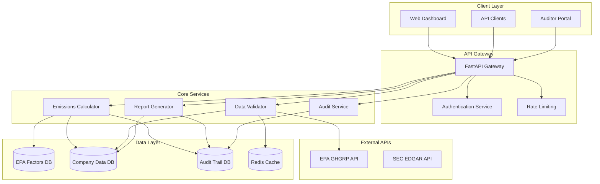

# Design Document

## Overview

The ENVOYOU SEC API is a FastAPI-based backend system designed to provide forensic-grade traceability for SEC Climate Disclosure Rule compliance. The system focuses on three core capabilities: GHG emissions calculation with EPA data integration, cross-validation against government databases, and automated SEC-compliant report generation.

The architecture emphasizes data integrity, audit trails, and regulatory compliance while maintaining high performance and scalability for mid-cap public companies.

## Architecture

### High-Level Architecture



### Technology Stack

- **Framework**: FastAPI with Python 3.11+
- **Database**: PostgreSQL for transactional data, TimescaleDB extension for time-series emissions data
- **Cache**: Redis for EPA data caching and session management
- **Authentication**: JWT tokens with role-based access control
- **Documentation**: OpenAPI/Swagger auto-generation
- **Monitoring**: Prometheus metrics with Grafana dashboards
- **Deployment**: Docker containers with Kubernetes orchestration
- **Data Retention**: Automated archival system for 7+ year SEC compliance
- **Security**: Data encryption at rest and in transit, audit logging for all data access
- **Business Continuity**: Multi-region deployment with disaster recovery (RTO: 4 hours, RPO: 1 hour)

## Components and Interfaces

### 0. Workflow & Approval Service

**Purpose**: Multi-level approval workflow for report submission

**Key Classes**:
```python
class WorkflowService:
    def create_approval_workflow(self, report_id: UUID, approvers: List[User]) -> Workflow
    def submit_for_approval(self, report_id: UUID, submitter: User) -> ApprovalRequest
    def approve_report(self, approval_id: UUID, approver: User, comments: str) -> ApprovalResult
    def lock_for_audit(self, report_id: UUID, auditor: User) -> AuditLock

class ReportState(Enum):
    DRAFT = "draft"
    PENDING_FINANCE_APPROVAL = "pending_finance"
    PENDING_LEGAL_APPROVAL = "pending_legal"
    PENDING_CFO_APPROVAL = "pending_cfo"
    APPROVED = "approved"
    UNDER_AUDIT = "under_audit"
    SUBMITTED_TO_SEC = "submitted"
```

**API Endpoints**:
- `POST /v1/workflow/submit/{report_id}` - Submit report for approval
- `POST /v1/workflow/approve/{approval_id}` - Approve/reject report
- `GET /v1/workflow/pending` - Get pending approvals for user
- `POST /v1/workflow/lock/{report_id}` - Lock report for audit
- `GET /v1/workflow/history/{report_id}` - Get approval history

### 1. Authentication & Authorization Service

**Purpose**: Secure access control with role-based permissions

**Key Classes**:
```python
class UserRole(Enum):
    CFO = "cfo"
    GENERAL_COUNSEL = "general_counsel"
    FINANCE_TEAM = "finance_team"
    AUDITOR = "auditor"
    ADMIN = "admin"

class AuthService:
    def authenticate_user(self, credentials: UserCredentials) -> AuthToken
    def authorize_action(self, token: AuthToken, action: str, resource: str) -> bool
    def create_audit_session(self, user_id: str) -> AuditSession
```

**API Endpoints**:
- `POST /v1/auth/login` - User authentication
- `POST /v1/auth/refresh` - Token refresh
- `POST /v1/auth/logout` - Session termination
- `GET /v1/auth/permissions` - User permissions

### 2. Emissions Calculator Service

**Purpose**: Core GHG emissions calculation with EPA factor integration

**Key Classes**:
```python
class EmissionsCalculator:
    def calculate_scope1_emissions(self, fuel_data: FuelConsumptionData) -> Scope1Emissions
    def calculate_scope2_emissions(self, electricity_data: ElectricityData) -> Scope2Emissions
    def get_emission_factors(self, year: int, region: str) -> EmissionFactors
    def create_calculation_audit_trail(self, calculation: EmissionsCalculation) -> AuditTrail

class EmissionFactors:
    fuel_factors: Dict[str, float]
    electricity_factors: Dict[str, float]
    source: str
    last_updated: datetime
    version: str
```

**API Endpoints**:
- `POST /v1/emissions/calculate` - Calculate emissions from input data
- `GET /v1/emissions/factors` - Retrieve current EPA emission factors
- `GET /v1/emissions/calculation/{id}` - Get specific calculation with audit trail
- `PUT /v1/emissions/factors/update` - Admin endpoint for factor updates

### 3. Data Validation Service

**Purpose**: Cross-validation against EPA GHGRP and other government databases

**Key Classes**:
```python
class DataValidator:
    def validate_against_ghgrp(self, company_data: CompanyEmissions) -> ValidationResult
    def check_data_consistency(self, historical_data: List[EmissionsData]) -> ConsistencyReport
    def generate_confidence_score(self, validation_results: ValidationResult) -> float
    def create_validation_report(self, company_id: str) -> ValidationReport

class ValidationResult:
    is_consistent: bool
    discrepancies: List[Discrepancy]
    confidence_level: float
    recommendations: List[str]
```

**API Endpoints**:
- `POST /v1/validation/validate` - Validate company emissions data
- `GET /v1/validation/report/{company_id}` - Get validation report
- `GET /v1/validation/ghgrp/{company_id}` - Get EPA GHGRP data for company
- `POST /v1/validation/batch` - Batch validation for multiple entities

### 4. Report Generation Service

**Purpose**: SEC-compliant report generation in multiple formats

**Key Classes**:
```python
class ReportGenerator:
    def generate_10k_disclosure(self, company_data: CompanyEmissions) -> SECReport
    def create_audit_ready_report(self, company_id: str) -> AuditReport
    def export_to_format(self, report: Report, format: ReportFormat) -> bytes
    def validate_report_completeness(self, report_data: ReportData) -> ComplianceCheck

class SECReport:
    climate_disclosures: ClimateDisclosures
    emissions_tables: List[EmissionsTable]
    risk_assessments: List[RiskAssessment]
    footnotes: List[Footnote]
    compliance_status: ComplianceStatus
```

**API Endpoints**:
- `POST /v1/reports/generate` - Generate SEC-compliant report
- `GET /v1/reports/{report_id}/download` - Download report in specified format
- `GET /v1/reports/templates` - Get available report templates
- `POST /v1/reports/validate` - Validate report completeness

### 5. Audit Trail Service

**Purpose**: Comprehensive audit logging and forensic traceability

**Key Classes**:
```python
class AuditService:
    def log_calculation(self, calculation: EmissionsCalculation, user: User) -> AuditEntry
    def log_data_change(self, change: DataChange, user: User) -> AuditEntry
    def get_audit_trail(self, entity_id: str, date_range: DateRange) -> List[AuditEntry]
    def generate_forensic_report(self, audit_session: AuditSession) -> ForensicReport

class DataLineageService:
    def track_data_origin(self, data_point: EmissionData) -> DataProvenance
    def verify_data_chain(self, calculation_id: UUID) -> ProvenanceChain
    def detect_anomalies(self, time_series: List[EmissionData]) -> AnomalyReport

class AuditEntry:
    id: UUID
    timestamp: datetime
    user_id: str
    action: str
    entity_id: str
    before_state: Optional[Dict]
    after_state: Dict
    metadata: Dict
```

**API Endpoints**:
- `GET /v1/audit/trail/{entity_id}` - Get audit trail for entity
- `GET /v1/audit/report/{session_id}` - Generate forensic audit report
- `GET /v1/audit/changes` - Get recent data changes
- `POST /v1/audit/session` - Create audit session for external auditors
- `GET /v1/audit/lineage/{calculation_id}` - Get data provenance chain
- `GET /v1/audit/anomalies/{company_id}` - Get anomaly detection results

## Data Models

### Core Entities

```python
class Company(BaseModel):
    id: UUID
    name: str
    ticker: str
    cik: str  # SEC Central Index Key
    fiscal_year_end: date
    entities: List[CompanyEntity]
    created_at: datetime
    updated_at: datetime

class CompanyEntity(BaseModel):
    id: UUID
    company_id: UUID
    name: str
    entity_type: EntityType
    ownership_percentage: float
    consolidation_method: ConsolidationMethod

class EmissionsData(BaseModel):
    id: UUID
    company_entity_id: UUID
    reporting_year: int
    scope1_emissions: float
    scope2_emissions: float
    calculation_method: str
    data_sources: List[DataSource]
    audit_trail_id: UUID
    created_at: datetime

class FuelConsumptionData(BaseModel):
    fuel_type: FuelType
    quantity: float
    unit: str
    location: str
    reporting_period: DateRange
    source_document: Optional[str]

class ElectricityData(BaseModel):
    consumption_kwh: float
    grid_region: str
    renewable_percentage: Optional[float]
    reporting_period: DateRange
    utility_provider: Optional[str]
```

### Database Schema Design

**Primary Tables**:
- `companies` - Company master data
- `company_entities` - Subsidiary and entity relationships
- `emissions_data` - Time-series emissions data (TimescaleDB)
- `emission_factors` - EPA factor data with versioning
- `calculations` - Calculation results with metadata
- `audit_trails` - Comprehensive audit logging
- `validation_results` - Cross-validation outcomes
- `reports` - Generated report metadata

**Indexes**:
- Company ticker and CIK for fast lookups
- Time-based indexes on emissions_data for reporting periods
- Composite indexes on audit_trails for forensic queries

## Error Handling

### Error Classification

1. **Validation Errors** (400 series)
   - Invalid input data format
   - Missing required fields
   - Business rule violations

2. **Authentication/Authorization Errors** (401/403)
   - Invalid credentials
   - Insufficient permissions
   - Expired tokens

3. **External Service Errors** (502/503)
   - EPA API unavailable
   - Database connection issues
   - Third-party service timeouts

4. **System Errors** (500 series)
   - Calculation engine failures
   - Unexpected system exceptions

### Error Response Format

```python
class ErrorResponse(BaseModel):
    error_code: str
    message: str
    details: Optional[Dict]
    timestamp: datetime
    request_id: str
    support_reference: Optional[str]
```

### Error Handling Strategy

- **Graceful Degradation**: System continues operating with reduced functionality when external services are unavailable
- **Retry Logic**: Automatic retry for transient failures with exponential backoff
- **Circuit Breaker**: Prevent cascade failures when external services are down
- **Comprehensive Logging**: All errors logged with context for debugging and audit purposes
- **EPA API Fallback**: Cached EPA data with staleness indicators when EPA services are unavailable
- **Draft Mode**: Allow partial data submission and save as drafts during system issues
- **Manual Override**: Emergency procedures for critical reporting deadlines

## Testing Strategy

### Unit Testing
- **Coverage Target**: 90%+ code coverage
- **Framework**: pytest with fixtures for database and external API mocking
- **Focus Areas**:
  - Emissions calculation accuracy
  - Data validation logic
  - Report generation formatting
  - Audit trail completeness

### Integration Testing
- **Database Integration**: Test with real PostgreSQL/TimescaleDB instances
- **API Integration**: Test EPA GHGRP API integration with mock responses
- **End-to-End Workflows**: Complete user journeys from data input to report generation

### Performance Testing
- **Load Testing**: Handle 100+ concurrent users during peak reporting periods
- **Stress Testing**: System behavior under extreme load conditions
- **Database Performance**: Query optimization for large datasets

### Security Testing
- **Authentication Testing**: JWT token validation and expiration
- **Authorization Testing**: Role-based access control verification
- **Input Validation**: SQL injection and XSS prevention
- **Audit Trail Integrity**: Tamper-proof audit logging verification

### Compliance Testing
- **SEC Format Validation**: Ensure reports meet exact SEC formatting requirements
- **EPA Data Accuracy**: Verify emission factor calculations against EPA standards
- **Audit Trail Completeness**: Validate forensic-grade traceability requirements
